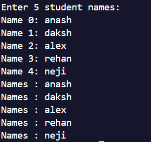
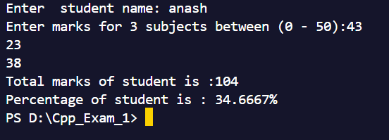
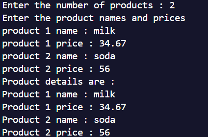
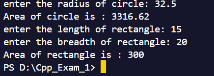

### Add and Display Students Program .

### Set Marks and Show total marks and percentage .

### Add Product name and prize and show them

### find radius of circle and area of rectangle

### Menu driven student management  
### Add Student
.png)
*Interface for adding new student records with details*

### Show Students
.png)
*List view of all registered students in the system*

### Delete Students
.png)
*Process of removing student records from the database*

### Exit Program
.png)
*Safe program termination and data saving process*
